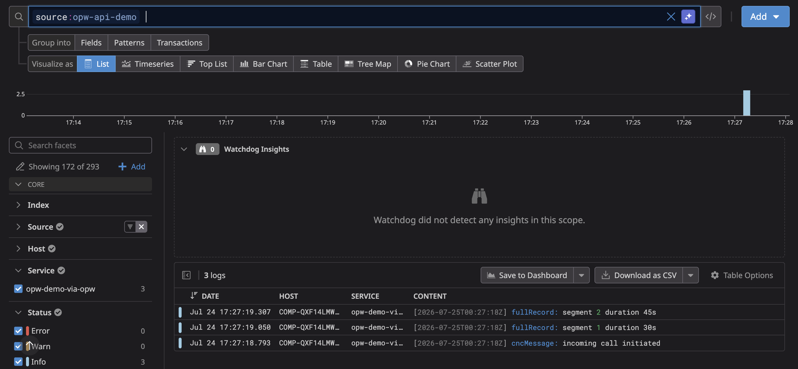
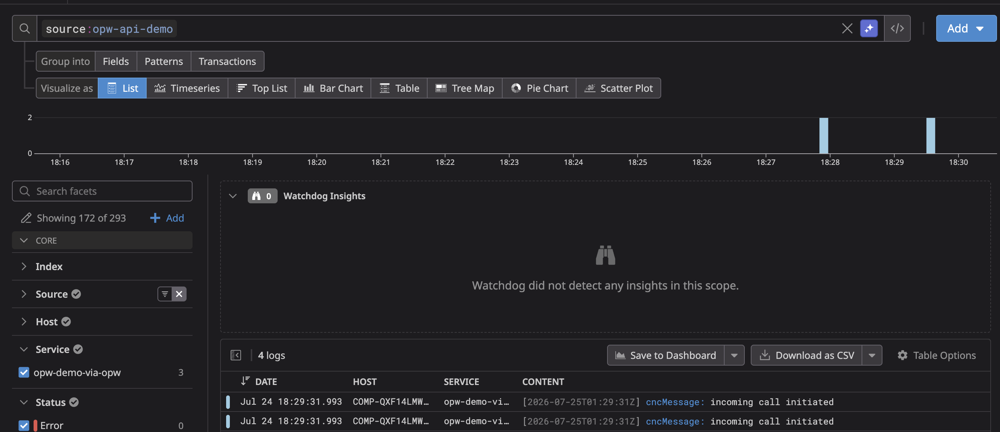

# OPW split->remap->merge + nginx HA Example

## Summary

**OPW Split** Arrays processor breaks the array `ongoing` into logs for each `record_id` in `ongoing.record_id`. Result is two logs from one in this example.  

**OPW Edit** Edit Fields processor remaps `ongoing.record_id` to `record_id` so we have a common attribute to merge.  

**Reduce processor** — Groups related log events (`cncMessage` + `fullRecords`) by `record_id` into single merged events. 3 events in, split and have 4 logs, remap, then merge and have 2 logs out after the 10s flush window. 10s is not configurable.  

**Horizontal scaling failure scenario** — nginx consistent-hash LB routes by `X-Record-ID` header so the same record always hits the same OPW instance so reduce works. But if that instance dies mid-reduce, the state is gone. demonstrates why in-memory reduce doesn't survive failures.  

## Stack

```
[client] -> nginx (consistent hash on X-Record-ID) -> opw1 / opw2 / opw3 -> Datadog  
  
The client is a script -> nginx -> op workers on the host we are on (e.g. tested on Mac OSX) -> Datadog  
  
Requirements:  
  
1) Docker  
  - docker-compose
2) bash  
3) Terraform  
```

## Setup

1) Export API and APP keys.  API keys are [here](https://app.datadoghq.com/organization-settings/api-keys)
 and APP keys are [here](https://app.datadoghq.com/organization-settings/application-keys).  

```bash
export DD_API_KEY=<API_KEY>  
export DD_APP_KEY=<APP_KEY>  
```
2) Create Pipeline  

```bash
cd terraform
terraform init
TF_VAR_dd_api_key=$DD_API_KEY TF_VAR_dd_app_key=$DD_APP_KEY terraform apply
```  

3) After entering yes for terraform apply  

```bash
export DD_OP_PIPELINE_ID=$(terraform output -raw pipeline_id)
cd ..
docker-compose up -d  
```
  
4) Ensure pipeline `opw-demo` is [active](https://app.datadoghq.com/observability-pipelines?isEditor=false&pageIndex=0&sort=created%2Cdesc&tab=pipelines)  
  
## Scripts

```bash
bash send-via-opw.sh # sends through OPW
```

## Usage

1) Unmodified logs: the initial pipeline has all processors turned off.  Therefore it is just a passthrough.  
  
```bash  
bash send-via-opw.sh  
```  
  
  
  
2) Turn processors on:
  
```bash
cd terraform
cp pipeline.tf pipeline-modified.tf
sed -i '' "s/true/true.bk/" pipeline-modified.tf
sed -i '' "s/false/true/" pipeline-modified.tf
sed -i '' "s/true.bk/false/" pipeline-modified.tf
```  
  
3) Apply changes to turn processors on  

```bash
mv pipeline.tf ..  
TF_VAR_dd_api_key=$DD_API_KEY TF_VAR_dd_app_key=$DD_APP_KEY terraform apply  
```  
  
Ensure pipeline opw-demo is [active](https://app.datadoghq.com/observability-pipelines?isEditor=false&pageIndex=0&sort=created%2Cdesc&tab=pipelines)  
  
4) Send logs  
  
```bash
# get back to repo root  
cd ..
bash send-via-opw.sh  
```  
  
  
  
## horizontal scaling

Consistent-hash routing works in steady state. When an instance dies, only its keys remap (consistent hashing, not full rebalance). But in-memory reduce state dies with the process — no persistence, no replication. Calls mid-window on the dead instance produce partial merges, logs are lost.

Real options if HA matters:
- Accept it (fast restart + monitoring, partial merges are rare)
- Fix at source (emit one complete event per call instead of 3)
- Use Kafka Streams if you need durable distributed state — OPW doesn't have an equivalent

## Teardown

```bash
docker-compose down
cd terraform
TF_VAR_dd_api_key=$DD_API_KEY TF_VAR_dd_app_key=$DD_APP_KEY terraform destroy  
```  
  
Clean up configuration  
  
```bash
rm pipeline-modified.tf  
cd ..
mv ../pipeline.tf .  
```
